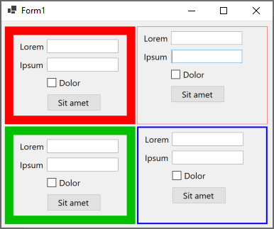

# Customize panel border size and border color

This example shows how to customize nonclient area of a panel. I've added `BorderColor` and `BorderWidth` properties to the panel and by handling the following messages:

* [`WM_NCCALCSIZE`](https://docs.microsoft.com/en-us/windows/win32/winmsg/wm-nccalcsize?WT.mc_id=DT-MVP-5003235): To change the size of the nonclient area
* [`WM_NCPAINT`](https://docs.microsoft.com/en-us/windows/win32/gdi/wm-ncpaint?WT.mc_id=DT-MVP-5003235): To paint on the nonclient area.

The implementation works in right to left mode and also in auto-scroll mode.